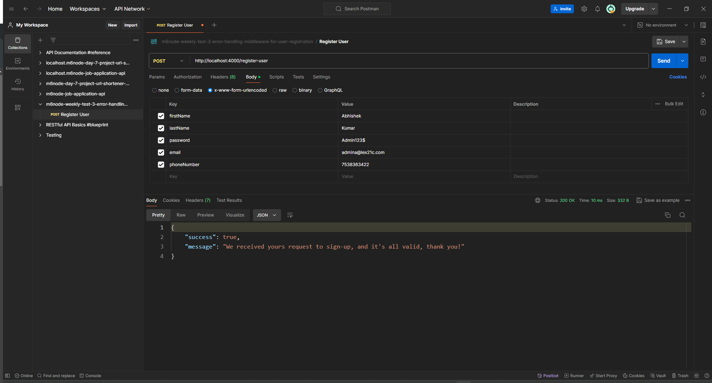

# Error Handling Middleware for User Registration(Weekly Test 3, Module #6, MERN Stack)


## Objective:
To build an error handling middleware for a user registration system. The system will accept requests from Postman for user registration, and it will enforce certain criteria for the input data. The middleware will ensure that the provided data meets specific requirements, and it will respond with appropriate error messages if any criteria are not met.

### Validate First Name and Last Name:
+ Ensure that the first letter of both the first name and last name is capitalized.
+ If the names do not meet this criteria, respond with an error message indicating the issue.
### Validate Password:
+ Check if the password contains at least one special character, one uppercase letter, and one numeric character.
+ Ensure that the password has a minimum length of 8 characters.
+ If the password does not meet these criteria, respond with an error message indicating the issue.
### Validate Email Address:
+ Verify that the email address provided contains the "@" symbol.
+ If the email address is invalid, respond with an error message indicating the issue.
### Validate Phone Number:
+ Check if the phone number has a minimum length of 10 digits.
+ If the phone number is too short, respond with an error message indicating the issue.

## How to install and run in yours local machine
```bash
npm install
npm run start
```

## Tech. Stack Used:
+ [MongoDB](https://www.mongodb.com/) 
+ [ExpressJS](https://expressjs.com/) 
+ [ReactJS](https://react.dev/) 
+ [NodeJS](https://nodejs.org/en/) 

## Author
[Abhishek kumar](https://www.linkedin.com/in/alex21c/), ([Geekster](https://geekster.in/) MERN Stack FS-14 Batch)


